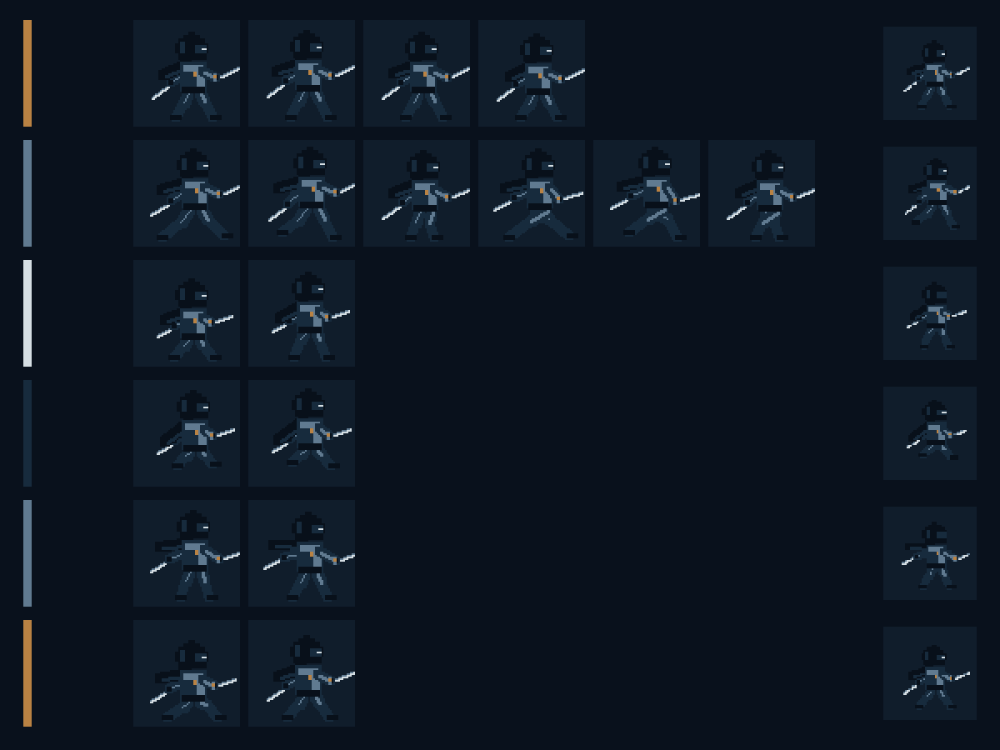

# M1 Player Movement and Animation QA

Date: 2026-07-21
Godot: 4.7.1 stable (`a13da4feb`)
Scope: horizontal movement, single jump, assists, collision, camera, and six locomotion animations only

## Animation evidence

Rows from top: Idle (4), Run (6), Jump Start (2), Jump Loop (2), Fall (2), and Land (2). Production frames are shown at exact 2× scale; the right column is a representative 48×48 nearest-neighbor readability check.

## Automated checks

- Dedicated A/D, arrow-key, and Space input actions exist.
- Ground acceleration reaches 220 px/s and ground deceleration reaches zero.
- CharacterBody2D settles on the static floor without penetration.
- Normal jump enters Jump Start, then Jump Loop, Fall, Land, and Idle.
- A jump pressed after leaving a ledge succeeds inside the 0.10-second coyote window.
- A jump pressed shortly before contact succeeds inside the 0.12-second input buffer.
- Horizontal input interrupts Land into Run.
- Left input sets `flip_h=true` without moving the visual or collision transform.
- Camera2D is enabled and follows as a child of Player.
- M1 art is 64×64, has no mipmaps, and remains readable at 48×48.
- Formal Player state mappings contain only the six authorized M1 animations.

## Manual checks

Run the project and use A/D or the arrow keys plus Space. Verify acceleration feel, edge jumps, buffered landing jumps, camera comfort, and whether the two-frame Land should remain fully interruptible by held horizontal input.
