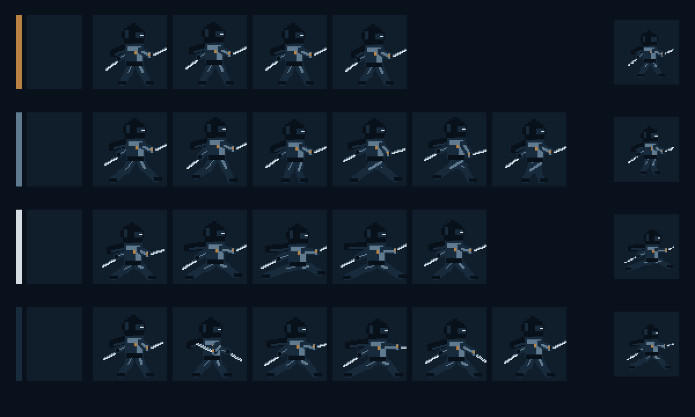

# Player Pixel Animation QA Report

Date: 2026-07-21
Godot: 4.7.1 stable (`a13da4feb`)
Scope: first Night Warden animation batch only; no M1 gameplay integration

## Visual evidence

The rows, from top to bottom, are Idle (4), Run (6), Dash (5), and Attack (6). Each production frame is displayed at exact 2× nearest-neighbor scale. The far-right image in every row is a representative frame resized to 48×48 with nearest-neighbor sampling and displayed at exact 2× scale.

## Automated checks

- 21 expected PNGs exist and each source is exactly 64×64.
- Every frame has transparent background, binary alpha, visible pixels, and only the fixed five-color palette.
- All frames within each animation have unique SHA-256 values.
- Godot imports every frame as a `Texture2D` without mipmaps or dimension changes.
- Each 48×48 nearest-neighbor check retains binary alpha and more than 120 visible pixels.
- Dash frame 03 is visibly lower than Idle frame 01.
- Dash frame 03 and Attack frame 04 are distinct files and distinct poses.
- The four reference copies are byte-identical to the original front, side, dash, and attack images.
- The formal Main remains `res://scenes/main/main.tscn`; the canvas texture default remains Nearest.

## Visual review

- Idle: eye, hood, leg gap, and two blades remain stable while the torso breathes by one pixel.
- Run: front/rear legs alternate over six frames and arms counter-swing without collapsing both blades into one shape.
- Dash: the hood and torso are lowered, the rear leg extends left, and both weapons remain visible.
- Attack: a crossed-blade load precedes the planted forward thrust; the follow-through changes blade angle instead of reading as travel.
- 48px: the pointed hood, pale eye, torso segmentation, leg separation, main blade, and offhand blade remain recognizable in all four representative checks.

## Manual preview

Run `scenes/tools/player_animation_preview.tscn` as the current scene. Use buttons or physical number keys `1`–`4` for Idle, Run, Dash, and Attack. The preview uses `AnimatedSprite2D`, explicit Nearest texture filtering, and 6× integer scaling.
